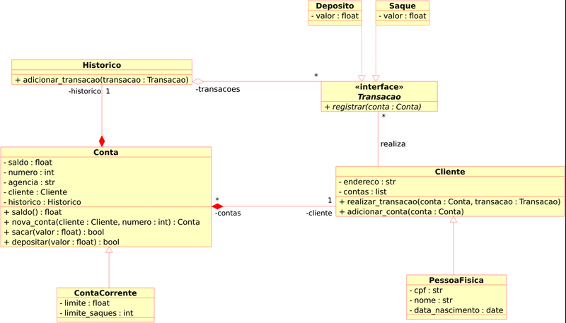

# **Desafio de Projeto**

## **Sistema Bancário com Python**

Conteúdo: Aplicação dos conceitos de Programação Orientada a Objetos ao sistema.

Linguagem Utilizada: Python

----
### **DESAFIO**
Iniciar a modelagem do sistema bancário em POO.

**Objetivo geral**
- Atualizar a implementação do sistema bancário, para armazenar os dados de clientes e contas bancárias em objetos.

- Adicionar classes para cliente e para as operações bancárias: depósito e saque.
 
- O código deve ser estruturado de acordo com a modelagem do diagrama de de classes UML.
----
**Diagrama de Classes UML**

----
### Resumo do Projeto
O projeto consiste na implementação de um sistema que execute as funcionalidades de um sistema bancário como depósitos, saques, criação de contas, etc., e que funcione de acordo com as [regras preestabelecidas](regras).

----
**Funcionalidades:**
- Cadastrar um novo cliente
- Criar uma nova conta 
- Efetuar depósitos
- Efetuar saques
- Exibir o histórico de uma conta
- Listar as contas existentes  

**Regras:**

*quanto a criação de contas*
- Todas as contas criadas iniciam com saldo zero e pertencentes a "Agência 0001".
- Um cliente possui nome, CPF, data de nascimento e endereço. 
- O sistema não deve permitir a criação de uma conta sem que o titular seja um cliente cadastrado.
  
*quanto a depósitos*
- O sistema não deve permitir depósitos de valores negativos.

*quanto a saques*
- O sistema não deve permitir saques de valores superiores ao saldo da conta.
- O sistema deve limitar a quantidade de saques a cinco saques por conta.
- O saques devem possuir limite máximo de mil reais por saque.

*quanto ao histórico*
- O sistema deve exibir no histórico o valor e o tipo de cada movimentação realizada.

*quanto a listagem de contas*
- Ao listar as contas o sistema deve exibir apenas a agência, os números das contas e nome de cada titular.

----
A organização das pastas e arquivos pode ser conferida na [estrutura do projeto](docs/estrutura_do_projeto.png) 

----

*Criado por Carlos Henrique Pinheiro*
