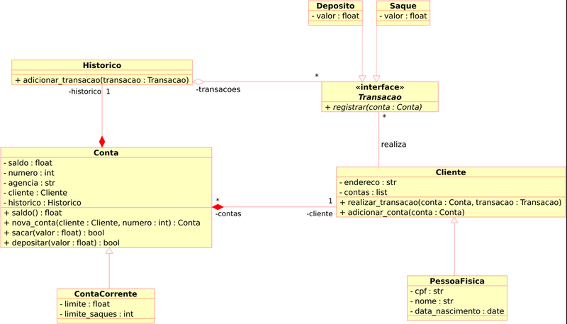

# **Desafio de Projeto**

## **Sistema Bancário com Python**

Conteúdo: Aplicação dos conceitos de Programação Orientada a Objetos ao sistema.

Linguagem: Python

----
### **DESAFIO**
Iniciar a modelagem do sistema bancário em POO.

**Objetivo geral**
- Atualizar a implementação do sistema bancário, para armazenar os dados de clientes e contas bancárias em objetos.

- Adicionar classes para cliente e para as operações bancárias: depósito e saque.
 
- O código deve ser estruturado de acordo com a modelagem do diagrama de de classes UML.
----
**Diagrama de Classes UML**

